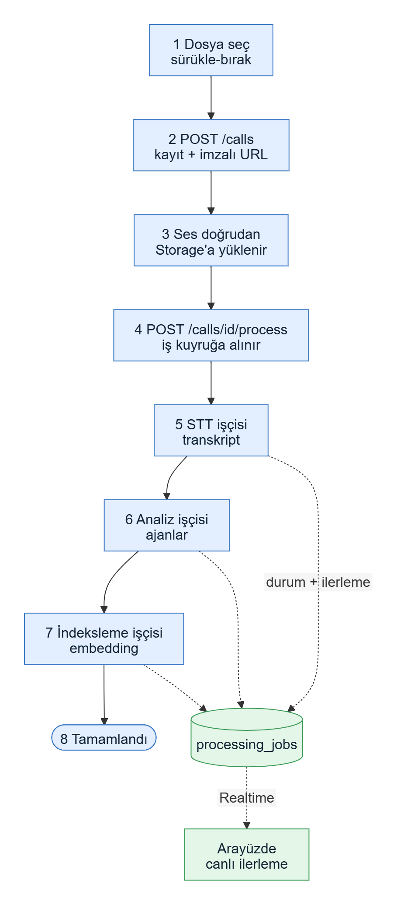
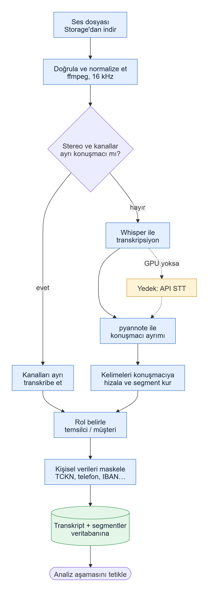
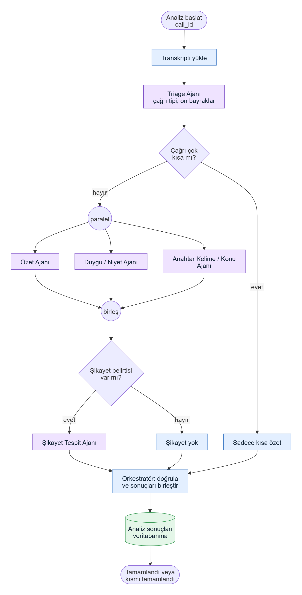
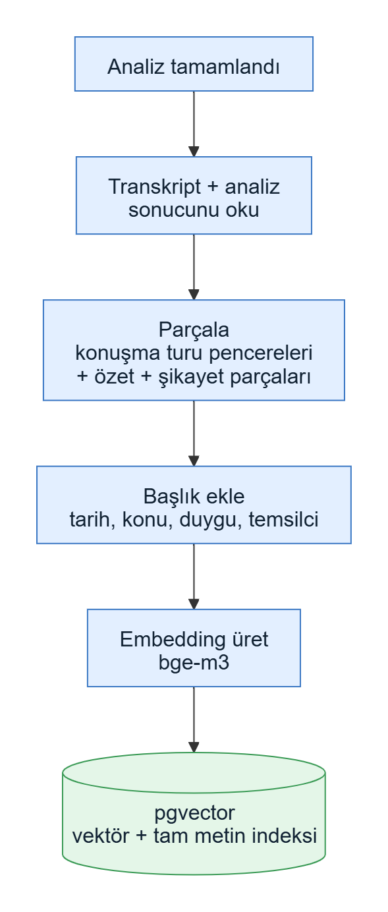
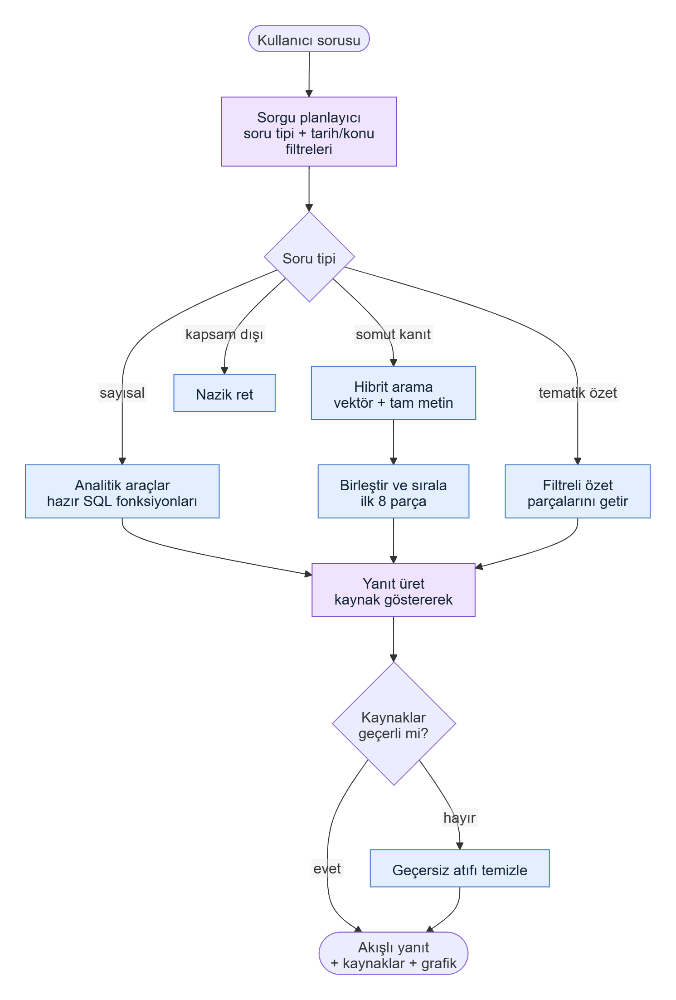
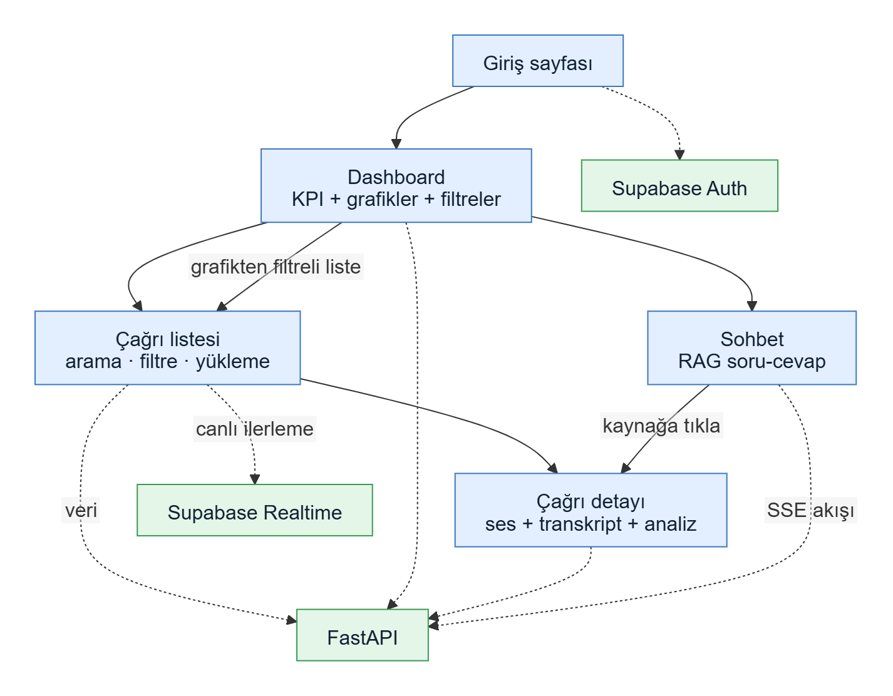
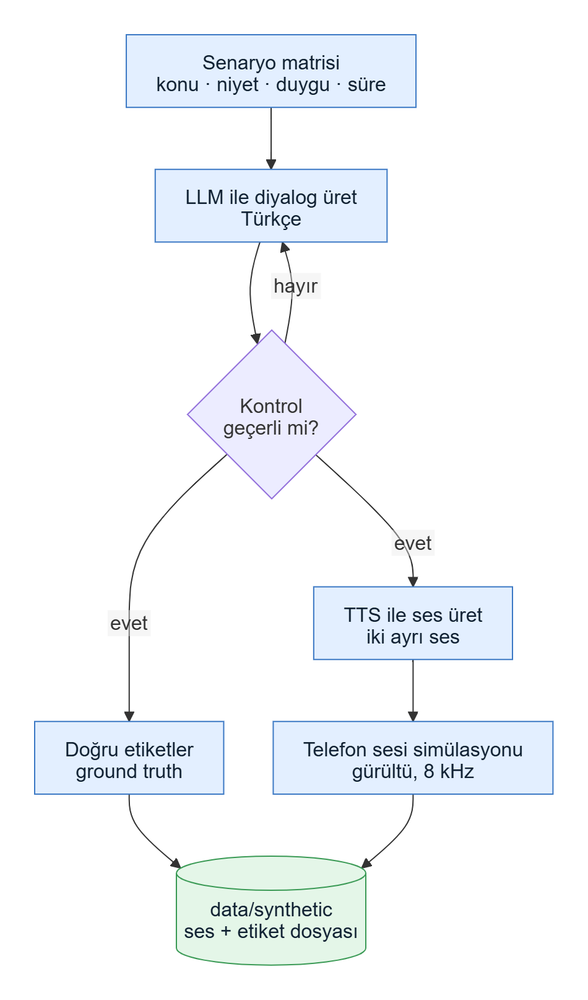

# Sistem Mimarisi v1

**Proje:** Yapay Zekâ Destekli Sesli Asistan ve Çağrı Merkezi Analitiği Sistemi
**Sürüm:** v1.0 · **Tarih:** 2026-09-30 · **Durum:** Taslak · **Kaynak:** Bitirme_Projesi_Yol_Haritasi.pdf

Bu doküman ilk adımdır: yalnızca ana hatlar ve pipeline şemaları vardır. Ayrıntılar ihtiyaç oldukça eklenir; mimari değişirse dosya `Sistem_mimarisi_v2.md` olur.
---

## 1. Amaç ve Kapsam

- Kaydedilmiş çağrı merkezi görüşmelerini metne çevirir, yapay zekâ ile analiz eder, geçmiş görüşmeler üzerinde soru sorulabilir hâle getirir ve tek bir web arayüzünde sunar.
- **Kapsam içi:** ses yükleme, konuşma metne çevirme (STT), konuşmacı ayrımı, özet, duygu, niyet, anahtar kelime/konu, şikayet tespiti, RAG sohbet, dashboard.
- **Kapsam dışı:** canlı çağrı akışı, telefon santrali entegrasyonu, çoklu kiracı, model eğitimi (fine-tuning).
- **Terimler:** *Ajan* = yapay zekâ bileşeni. *Temsilci* = çağrı merkezindeki insan.

## 2. Temel Kararlar

- **Backend FastAPI (Python).** Ağır işler (STT, LLM analizi, embedding) API içinde değil, Celery + Redis işçilerinde çalışır.
- **Tek veritabanı:** Supabase PostgreSQL. Vektör (pgvector), tam metin arama, kimlik doğrulama, dosya depolama ve canlı bildirim (Realtime) aynı yerde. Ayrı vektör veritabanı yok.
- **Şemanın tek kaynağı Supabase SQL migration'ları** (Alembic kullanılmaz).
- **Ajanlar önce sıralı, sonra LangGraph.** Ajan mantığı framework'ten bağımsız yazılır; Hafta 10'da aynı ajanlar LangGraph düğümü olur. Sıralı sürüm yedek olarak kalır.
- **LLM sağlayıcısı değiştirilebilir.** Model adları ortam değişkeninden gelir; ücretsiz modellerle başlanır, gerekirse sonradan başka modele geçilir.
- **Yapılandırılmış çıktı:** her ajan Pydantic şemasına uyan JSON döner.
- **RAG'de sayısal sorular SQL araçlarıyla** cevaplanır ("kaç şikayet geldi" vektör aramayla doğru sayılamaz); yorum ve örnek soruları hibrit arama cevaplar.
- **Ses dosyası doğrudan Storage'a yüklenir**, backend'den geçmez. İlerleme, veritabanı üzerinden Realtime ile arayüze akar.
- **STT sağlayıcısı değiştirilebilir:** yerel Whisper (GPU) veya API (GPU yoksa).
- **Varsayılan veri sentetiktir** (KVKK riski yok). LLM'e giden metin kişisel veriden arındırılır (maskelenir).
- **Kod ve veritabanı İngilizce, arayüz ve LLM çıktısı Türkçe.**

## 3. Genel Mimari

Kullanıcı yalnızca frontend ile konuşur. Frontend; veriyi FastAPI'den, girişi ve canlı ilerlemeyi Supabase'ten alır, ses dosyasını doğrudan Supabase Storage'a yükler. Uzun süren işler Redis kuyruğu üzerinden Celery işçilerine gider.

## 4. Teknoloji ve Sürümler

Sürümler 2026-09-30'da PyPI, npm ve Docker Hub'dan doğrulanan son kararlı sürümlerdir. Kilit dosyaları (`uv.lock`, `package-lock.json`) repoya girer; Hafta 8'den sonra ana sürüm yükseltilmez.

| Katman | Teknoloji | Sürüm |
|--------|-----------|-------|
| Dil (backend) | Python | 3.12 |
| API | FastAPI + Uvicorn | 0.142 / 0.54 |
| Doğrulama | Pydantic | 2.13 |
| ORM | SQLAlchemy (async) + asyncpg | 2.1 / 0.31 |
| Kuyruk | Celery + Redis | 5.6 / 8.10 |
| Ajan orkestrasyonu | LangGraph + LangChain | 1.2 / 1.4 |
| STT | faster-whisper (Whisper large-v3) | 1.2.1 |
| Konuşmacı ayrımı | pyannote.audio | 4.0 |
| Embedding | bge-m3 (TEI servisi ile) | TEI 1.9 |
| LLM | Ücretsiz API modelleri (ör. Groq, OpenRouter) | env ile seçilir |
| Veritabanı | PostgreSQL + pgvector (Supabase) | 17 / 0.8 |
| Dil (frontend) | Node.js LTS / TypeScript | 24 / 6.0 |
| Web | Next.js + React | 16.3 / 19.3 |
| Stil ve grafik | Tailwind CSS + Recharts | 4.3 / 3.10 |
| Veri çekme | TanStack Query | 5.104 |
| Auth + Realtime istemcisi | supabase-js | 2.117 |
| Paket/altyapı | uv, Docker | 0.12 / 29 |

Notlar: Python 3.12 seçildi çünkü ML paketleri (torch, pyannote) için en düşük riskli sürüm. TypeScript 7 yerine 6.0 seçildi çünkü lint araçları henüz 7'yi desteklemiyor.

## 5. Pipeline'lar

### 5.1 Yükleme ve İşleme Akışı

- Bir çağrı şu durumlardan geçer: yüklendi → kuyrukta → transkripsiyon → analiz → indeksleme → tamamlandı. Ajanların bir kısmı başarısız olursa "kısmi", hepsi başarısız olursa "hata" olur.
- Her aşama tekrar çalıştırılabilir; başarısız aşama baştan değil, kaldığı yerden yeniden denenir.
- Aynı dosya tekrar yüklenirse (SHA-256) uyarı verilir.

### 5.2 STT Pipeline'ı (Ses → Transkript)

- Stereo kayıtta iki kanal ayrı konuşmacıysa konuşmacı ayrımı gerekmez, kanallar ayrı çevrilir (en doğru yöntem). Mono kayıtta pyannote kullanılır (2 konuşmacı olarak sabitlenir).
- Rol (temsilci / müşteri) önce kurallarla, belirsizse ucuz bir LLM ile belirlenir; yanlışsa arayüzden düzeltilebilir.
- Kişisel veriler (TCKN, telefon, IBAN, kart, e-posta) maskelenir; LLM ve embedding yalnızca maskeli metni görür.
- GPU yoksa STT için API yedeği kullanılır.

### 5.3 Multi-Agent ve Orkestratör

- **Triage Ajanı:** çağrı tipini ve ön bayrakları çıkarır (ucuz ön geçiş).
- **Özet Ajanı:** kısa özet, çözüm durumu, aksiyonlar.
- **Duygu/Niyet Ajanı:** segment bazlı duygu, müşteri niyeti, tahmini memnuniyet (CSAT).
- **Anahtar Kelime/Konu Ajanı:** ana konu (sabit kategori listesinden) ve anahtar kelimeler.
- **Şikayet Tespit Ajanı:** şikayet, şiddet, eskalasyon gereği. Yalnızca şikayet belirtisi varsa çalışır (maliyet tasarrufu).
- **Orkestratör:** ajanları çalıştırır, sonuçları doğrular ve birleştirir. Bağımsız üç ajan paralel çalışır.
- Bir ajan çökerse çağrı "kısmi" tamamlanır, diğer sonuçlar kaybolmaz. Yanlış çıktıda önce bir kez düzeltme denenir, sonra güçlü modele geçilir.
- Duygu tahmini gerçek anket sonucu değildir; arayüzde "tahmini" olarak etiketlenir.

### 5.4 RAG Sistemi

İndeksleme (analiz bittikten sonra):

Soru sorma (sohbet):

- Soru önce planlanır: sayısal mı, kanıt mı, tematik özet mi, kapsam dışı mı.
- Sayılar yalnızca hazır SQL fonksiyonlarından gelir; LLM hiçbir zaman kendi SQL'ini yazmaz. Dashboard ile sohbet aynı fonksiyonları kullandığından sayılar tutarlıdır.
- Arama hibrittir: vektör + Türkçe tam metin, sonuçlar birleştirilip ilk 8 parça alınır.
- Yanıtta kaynak (çağrı ve zaman) gösterilir; kanıt yoksa "bulamadım" denir.

### 5.5 Frontend

- **Sayfalar:** giriş, dashboard (KPI, duygu trendi, konu dağılımı, şikayet oranı, filtreler), çağrı listesi ve yükleme, çağrı detayı (ses oynatıcı + transkript senkron + analiz), sohbet.
- Veri yalnızca FastAPI'den alınır; Supabase yalnızca giriş ve canlı ilerleme içindir.
- Sohbet yanıtları SSE ile akış olarak gelir. API tipleri FastAPI'nin OpenAPI şemasından otomatik üretilir.

### 5.6 Sentetik Veri Pipeline'ı

- LLM ile senaryo bazlı Türkçe diyalog üretilir, TTS ile sese çevrilir. Etiketler üretim sırasında bilindiği için hem test verisi hem de **doğruluk ölçümü** (ground truth) sağlar.
- Hedef: yaklaşık 150 çağrı (30'u dokunulmaz test seti), üç aylık tarih dağılımı, stereo ve mono karışık.

## 6. Veritabanı (Ana Tablolar)

- **calls** — çağrı, durum, süre, tarih, temsilci
- **processing_jobs** — aşama ve ilerleme (Realtime ile arayüze akar)
- **transcripts / transcript_segments** — konuşmacı, zaman, ham ve maskeli metin
- **analyses** — özet, niyet, duygu, memnuniyet, şikayet; her yeniden analiz yeni sürüm olur
- **agent_runs** — ajan başına girdi/çıktı, token, süre (önbellek ve maliyet takibi)
- **segment_analyses, complaints, call_keywords, topics** — ayrıntılı analiz sonuçları
- **segment_chunks** — RAG parçaları (vektör + tam metin indeksi)
- **chat_sessions / chat_messages** — sohbet geçmişi ve kaynaklar
- **profiles / representatives** — kullanıcılar ve temsilciler

## 7. Repo Klasörleri

- `backend/` — FastAPI, ajanlar, STT, RAG, işçiler, testler
- `frontend/` — Next.js uygulaması
- `supabase/` — migration'lar ve yerel Supabase ayarı
- `infra/` — docker-compose
- `data/` — ham, sentetik ve işlenmiş veri (büyük dosyalar git'e girmez)
- `docs/` — mimari dokümanı, diyagramlar, toplantı notları

## 8. Kararlar ve Açık Konular

**Karara bağlananlar**

- **Sektör: telekomünikasyon.** Konu kategorileri (fatura, tarife/paket, internet arızası, kapsama, iptal, cihaz desteği, ödeme, diğer) ve sentetik senaryolar buna göre hazırlanır.
- **LLM: ücretsiz API modelleri.** Ücretsiz katmanların hız ve günlük istek sınırları olduğundan eşzamanlı çağrı sayısı düşük tutulur, sonuçlar önbelleğe alınır ve model adı ortam değişkeninden değiştirilebilir kalır.

**Bekleyenler**

- **Donanım (GPU):** Takımın donanımı henüz bilinmiyor. Altyapı kurulumu sırasında netleşecek; GPU yoksa STT için API yedeği kullanılır.
- **"Sesli Asistan" kapsamı:** Yalnızca kayıt analizi mi, sesle soru–cevap da isteniyor mu? Danışman hocaya sorulacak.
- **Yayın ortamı:** Backend nerede çalışacak? Danışman hocaya sorulacak (frontend için Vercel öneriyorum).

## 9. Değişiklik Günlüğü

- **v1.0 (2026-09-30):** İlk mimari taslağı. Sektör (telekom) ve LLM (ücretsiz API modelleri) kararları eklendi.
