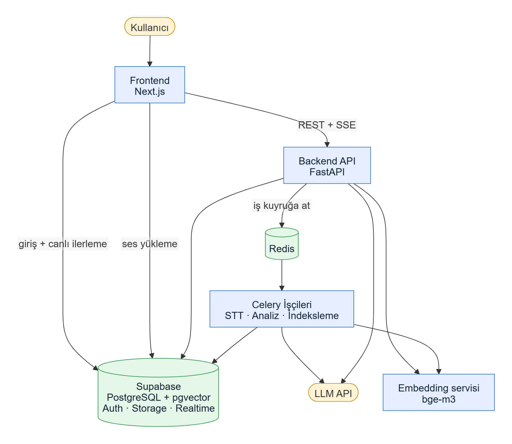
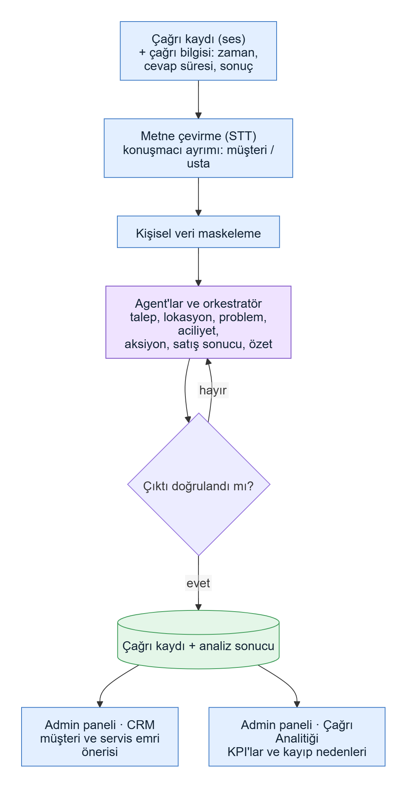
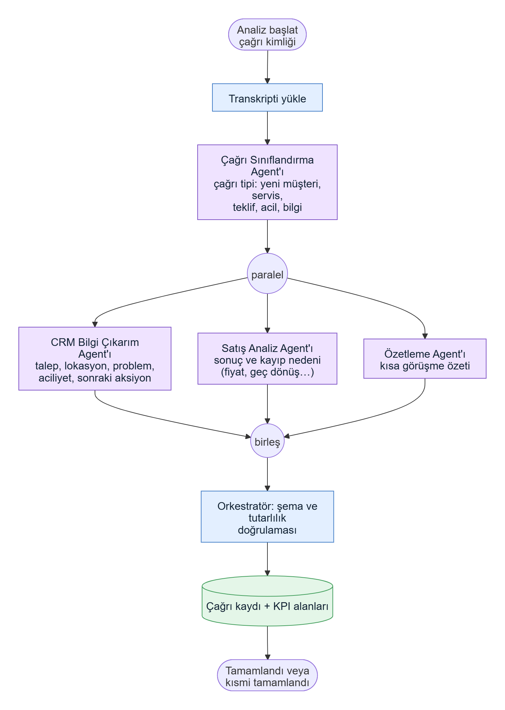
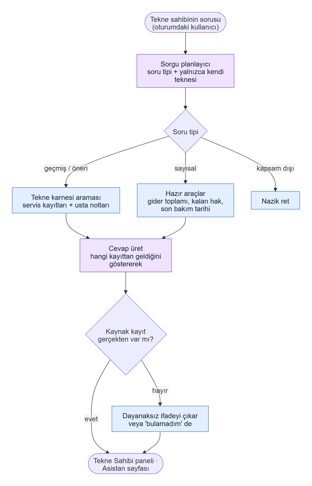
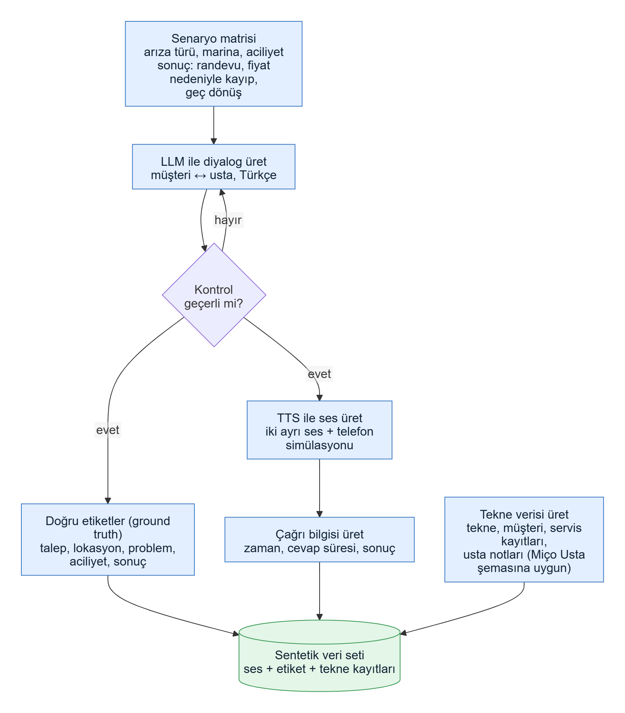

# Sistem Mimarisi v3.1

**Proje:** Yapay Zekâ Destekli Sesli Asistan ve Çağrı Merkezi Analitiği Sistemi
**Sürüm:** v3.1 · **Tarih:** 2026-10-08 · **Durum:** Güncel · **Önceki sürümler:** v1, v2, v3.0 (git geçmişinde)

**v3'te değişenler (v3.1 bunun üstüne eklenen güncellemedir):** Sıfırdan bir web sitesi kurmuyoruz. Hocamızın verdiği hazır **Miço Usta** uygulamasına (tekne bakım ve servis platformu) belirli sayfalar ekleyip arkada çalışan **AI servisimizi** buraya entegre edeceğiz. Sektör telekomdan **tekne servisine** geçti; veriler sentetik. Ayrıntılar §3'te.

---

## 1. Amaç ve Kapsam

- Miço Usta uygulamasına üç iş ekliyoruz (hocanın senaryo numaralarıyla 1, 5 ve 2):
  1. **Çağrı → CRM kaydı (Admin paneli):** Müşteriyle yapılan telefon görüşmesi otomatik analiz edilir; talep, lokasyon, problem, aciliyet ve sonraki aksiyon çıkarılıp CRM kaydı önerilir.
  2. **Çağrı Analitiği (Admin paneli):** Aylık KPI'lar ve "satış neden kaçtı" analizi.
  3. **Miço AI (Tekne Sahibi paneli):** Tekne sahibinin kişisel asistanı; tekne karnesi, işler, giderler ve abonelik verisinden cevap verir.
- **Kapsam dışı:** Usta paneli, canlı (gerçek zamanlı) çağrı akışı, telefon santrali entegrasyonu, model eğitimi.
- **Terimler:** *Agent* = yapay zekâ bileşeni. *Usta* = tekne teknisyeni.

## 2. Takvim

| Tarih | Olay |
|-------|------|
| 6–8 Ekim | Ön değerlendirme sunumları |
| 16 Kasım 23:59 | Vize sunumu yükleme (sunum: 17–19 Kasım) |
| 14 Aralık | Final sunumu yükleme (sunum: 15–17 Aralık); **canlıya alma final zamanı** |
| 28 Aralık | Demo ve tez son teslim |
| 5 Ocak | Demo ve poster sunumu |

**Vize hedefi:** Admin panelinde çağrı analizi ve CRM kaydı çalışır durumda (iş 1 ve 2). **Vizeden sonra:** Miço AI (iş 3), Google Cloud'a canlıya alma, ölçümler.

## 3. Temel Kararlar

- **Hazır uygulamaya entegrasyon.** Miço Usta (Next.js arayüz, .NET 10 backend, PostgreSQL, Redis, Google Cloud) olduğu gibi kalır; biz ona yeni sayfalar ekleriz.
- **AI servisimiz ayrı bir Python servisi (FastAPI) olarak çalışır** ve .NET uygulamasıyla REST (JSON) üzerinden konuşur. Python seçimi, LLM, agent ve RAG kütüphanelerinin ağırlıklı olarak Python ekosisteminde olmasındandır. *(Hocaya soruldu, yanıt bekleniyor.)*
- **Orkestratör baştan LangGraph ile kurulur.** Agent'lar aşamalar halinde çalışır: önce Çağrı Sınıflandırma, sonra diğer üç agent paralel. Yeni agent eklemek akışı değiştirmez.
- **LLM sağlayıcısı değiştirilebilir:** Host sistem Vertex AI/Gemini kullanıyor; biz sağlayıcıyı ayardan seçilebilir tuttuk. Geliştirmede ücretsiz API'ler, uyumluluk için Gemini.
- **Yapılandırılmış çıktı:** Her agent şemaya uygun JSON döner; çıktı doğrulanmadan CRM'e yazılmaz.
- **Veritabanı:** Geliştirmede ortak veritabanı olarak **Supabase** kullanılır. Yalnızca standart PostgreSQL + pgvector özellikleri kullanılır (Supabase Auth ve RLS'e bağımlılık yok), şema **Alembic** migration'larıyla kurulur. Böylece canlı ortamda başka bir PostgreSQL'e taşınabilir. Canlı ortamda büyük ihtimalle kendi PostgreSQL'imiz olacak. *(Hocaya sorulacak.)*
- **Veri tamamen sentetiktir** (gerçek müşteri verisi yok, KVKK). LLM'e giden metin kişisel veriden arındırılır.
- **Tekne sahibi yalnızca kendi teknesinin verisini görür.** Asistan, oturumdaki kullanıcının yetkisiyle çalışır.
- **Kod ve veritabanı İngilizce, arayüz ve LLM çıktısı Türkçe.**
- **Süreç:** main'e doğrudan commit yok; her iş ayrı branch + PR, CI yeşil ve onaylı.

## 4. Genel Mimari

Kullanıcılar (admin ve tekne sahibi) Miço Usta'nın arayüzünü kullanır. Arayüz .NET API'ye konuşur; .NET API, çağrı analizi veya sohbet gerektiğinde bizim AI servisimizi çağırır. AI servisi, konuşma tanıma (STT) ve LLM servislerini kullanır; sonuçları (CRM kaydı önerisi ve KPI alanları) .NET API'ye döner veya ortak veritabanına yazar. Miço AI, cevap için tekne verisini Miço Usta API'sinden okur.

Not: Gezdiğimiz örnek site (Figma Make ile hazırlanmış bir prototip) arayüzün görünümünü gösteriyor. Gerçek uygulamanın kod tabanı ve veri şeması hocadan alınacaktır.

## 5. Teknoloji

| Katman | Miço Usta (hazır) | Bizim AI servisimiz |
|--------|-------------------|---------------------|
| Backend | .NET 10 | Python 3.12 + FastAPI 0.142 |
| Arayüz | Next.js | Ahmet, hazır Next.js uygulamasına sayfa ekler |
| Veritabanı | PostgreSQL | PostgreSQL 17 + pgvector; geliştirmede Supabase, migration'lar Alembic |
| Kuyruk / önbellek | Redis | Celery + Redis |
| Bulut | Google Cloud | Google Cloud'da canlıya alma |
| LLM | Vertex AI / Gemini | Sağlayıcı arayüzü: Gemini veya ücretsiz API'ler |
| Konuşma tanıma | — | Deepgram (Nova-3) veya Google'ın STT servisi; 5. haftada karşılaştırılacak |
| Agent orkestrasyonu | — | LangGraph + LangChain |

Sürümler 2026-09-30 ve 2026-10-04'te doğrulanmıştır; kilit dosyaları (`uv.lock`, `package-lock.json`) repoda tutulur.

## 6. Pipeline'lar

### 6.1 Çağrı Analitiği (Admin paneli, iş 1 ve 2)

- Girdi: çağrının **ses kaydı** ve **çağrı bilgisi** (çağrı zamanı, cevap süresi, sonuç).
- Ses metne çevrilir, konuşmacılar müşteri ve usta olarak ayrılır, kişisel veriler maskelenir.
- Agent'lar konuşmadan CRM alanlarını çıkarır. Çıktı doğrulanır; doğrulanmazsa agent'a bir kez düzeltme şansı verilir.
- Sonuç iki yere gider: **CRM** (müşteri ve servis emri önerisi) ve **Çağrı Analitiği** (KPI).
- Hocanın örneği: "Motor çalışıyor ama gaz verdiğimde devir yükselmiyor, Tuzla Marina'da, yarın usta gelebilir mi?" → talep: motor arızası, lokasyon: Tuzla Marina, aciliyet: yüksek, aksiyon: servis randevusu oluştur.

- **Çağrı Sınıflandırma Agent'ı:** çağrı tipi (yeni müşteri, servis, teklif, acil, bilgi).
- **CRM Bilgi Çıkarım Agent'ı:** talep, lokasyon, problem, aciliyet, sonraki aksiyon.
- **Satış Analiz Agent'ı:** satış sonucu ve kayıp nedeni (fiyat, geç dönüş).
- **Özetleme Agent'ı:** kısa görüşme özeti.
- **Orkestratör:** agent'ları çalıştırır, her çıktıyı şemasıyla yeniden doğrular ve sonucu yazar. Doğrulama hatasında agent'a hata mesajıyla bir kez düzeltme şansı verilir; çökme ve süre aşımı tekrar denenmez. Bir agent çökerse diğerlerinin sonucu korunur ve kayıt "kısmi" tamamlanır. Her agent çalışması (süre, deneme sayısı, hata) kaydedilir.

**KPI'ların kaynağı**

| KPI | Nereden gelir |
|-----|---------------|
| Gelen çağrı | Çağrı sayısı |
| Yeni müşteri, servis talebi, teklif talebi, acil servis | Konuşmadan çıkarılan çağrı tipi ve aciliyet |
| Satışa dönüşen, kaybedilme nedeni | Satış Analiz Agent'ı |
| En sık arıza, en yoğun marina | Konuşmadan çıkarılan problem ve lokasyon |
| Ortalama cevap süresi | Ses dosyasından çıkmaz; **çağrı bilgisinden** (çalma ve açılma zamanı) hesaplanır |

### 6.2 Miço AI (Tekne Sahibi paneli, iş 3)

- Soru önce planlanır: geçmiş/öneri, sayısal, kapsam dışı.
- Geçmiş ve öneri soruları tekne karnesi ve ustaların notları üzerinde aranır ("Son bakım ne zaman yapıldı?", "Yakında yapılması gereken bir şey var mı?").
- Sayısal sorular (gider toplamı, kalan paket hakkı, son bakım tarihi) hazır araçlarla hesaplanır; LLM sayıyı kendisi uydurmaz.
- Cevapta hangi kayda dayandığı gösterilir; kayıt yoksa "bulamadım" denir.
- Yetki: Yalnızca oturumdaki tekne sahibinin teknelerine ait veri kullanılır.
- Opsiyonel: Admin panelindeki mevcut "AI Asistan" sohbet kutusu aynı altyapıyla iyileştirilebilir (hocanın listesinde yok).

### 6.3 Sentetik Veri

- **Çağrı verisi:** Senaryo matrisinden (arıza türü, marina, aciliyet, sonuç) LLM ile Türkçe müşteri-usta diyalogları üretilir, sese çevrilir, doğru etiketler ve çağrı bilgisi (zaman, cevap süresi, sonuç) ayrıca kaydedilir.
- **Tekne verisi:** Miço Usta şemasına uygun tekne, müşteri, servis kaydı ve usta notları üretilir (Miço AI'nin cevap kaynağı).
- Doğru etiketler baştan bilindiği için sistemin doğruluğu otomatik ölçülür.
- Hedef: vizeye kadar 30+ çağrı, sonrasında yaklaşık 150 çağrı (30'u dokunulmaz test seti).

## 7. Arayüz: Hazır Uygulamaya Eklenecek Ekranlar

| Panel | Eklenecek / değişecek | Not |
|-------|-----------------------|-----|
| Admin | **Çağrı Analitiği** bölümü: KPI kartları, grafikler, kaybedilen satış nedenleri | Gösterge Paneli ile aynı görsel dilde |
| Admin | **CRM'de çağrıdan gelen kayıt önerisi:** analiz sonucunu inceleyip onaylama | Servis Emirleri ve Müşteriler ekranlarına bağlanır |
| Tekne Sahibi | **Asistan** sayfası: sohbet penceresi, kaynak gösterimi | Admin'deki mevcut sohbet kutusunun tasarımına benzer |
| Usta | Değişiklik yok | — |

## 8. Entegrasyon Sözleşmesi (Taslak)

.NET API ile AI servisi arasındaki arayüz; hocanın yanıtına göre kesinleşir.

| Uç | Ne yapar |
|----|----------|
| Çağrı analizi iste | Ses ve çağrı bilgisi gönderilir; kuyruğa alınır (202) |
| Analiz sonucunu al | CRM önerisi, KPI alanları, özet |
| KPI özeti | Tarih aralığına göre toplam KPI'lar |
| Asistan sohbeti | Soru ve kullanıcı kimliği gönderilir; kaynaklı cevap akış olarak döner |

- **Kimlik doğrulama:** .NET uygulaması AI servisini servis anahtarıyla çağırır; tekne sahibinin kimliği isteğe eklenir. (v2'deki Supabase girişi bu yüzden kalkar.)
- **Hatalar:** Tek tip hata biçimi (kod, mesaj, istek kimliği) korunur.

## 9. Veri

- **Bizim tablolarımız:** çağrılar, çağrı bilgisi, transkript ve segmentler, analiz sonuçları ve agent çalıştırma kayıtları, sohbet geçmişi, RAG parçaları (vektör + tam metin indeksi).
- **Miço Usta verisi** (tekneler, müşteriler, servis kayıtları, giderler, abonelikler): okunur; şema ve erişim yöntemi hocadan alınacak.
- Veritabanının nerede ve hangi şemayla tutulacağı **açık karar** (§12).

## 10. Canlıya Alma

- Hedef: **Google Cloud**; hoca "final zamanında canlıya alırız" dedi.
- AI servisi Google Cloud'da, hazır uygulamayla aynı ağda çalışır. Çalıştırma biçimi (konteyner, VM) ve veritabanı yönetimi netleşecek.
- LLM tarafı için Vertex AI/Gemini ile uyumluluk önemlidir; sağlayıcı arayüzümüz bunu destekler.

## 11. Mevcut Durum (8 Ekim)

| Alan | Durum |
|------|-------|
| Backend iskeleti (FastAPI, kuyruk, ayarlar, hata biçimi, sağlık uçları) | **Hazır** |
| Backend CI (lint, tip kontrolü, test, duman testi) | **Hazır** |
| LLM, agent, STT ve embedding arayüzleri | **Hazır** (içleri yazılacak) |
| Orkestratör (LangGraph): aşamalar, paralel çalışma, doğrulama ve düzeltme, kısmi başarı | **Hazır** (agent'lar yer tutucu; #17–#20'de yazılacak) |
| Miço Usta incelemesi | **Yapıldı** (üç panel gezildi) |
| Telekoma göre hazırlanan issue'lar | **Güncellendi** (4. hafta: #4–#24) |

**Backend'de yapılacak değişiklikler:** giriş doğrulamasını Supabase JWT'den servis anahtarına çevirmek; agent'ları tekne servisi alanına uyarlamak; STT sağlayıcısını (Deepgram veya Google) seçmek; LLM sağlayıcısına Gemini/Vertex AI seçeneği eklemek.

## 12. Açık Kararlar

| Karar | Durum |
|-------|-------|
| .NET ile Python servisi entegrasyon yöntemi | Hocaya soruldu, yanıt bekleniyor |
| Canlı veritabanı: kendi PostgreSQL'imiz mi, Miço Usta'nınki mi? | Büyük ihtimalle kendi; geliştirmede Supabase |
| Miço Usta veri şeması / örnek veri | Hocadan istenecek |
| STT: Deepgram mı, Google'ın STT servisi mi? | 5. haftada karşılaştırılacak (#15) |
| Canlıya alma ortamı ve biçimi (Google Cloud) | Final öncesi netleşecek |
| Admin'deki mevcut AI Asistan'ın iyileştirilmesi kapsama dahil mi? | Hocaya sorulacak |

## 13. Değişiklik Günlüğü

- **v3.1 (2026-10-08):** Orkestratör baştan LangGraph (paralel aşamalar, doğrulama ve tek düzeltme); geliştirmede Supabase + Alembic; STT kararı 5. haftaya; 4. hafta issue'ları güncellendi.
- **v3.0 (2026-10-07):** Hazır Miço Usta uygulamasına entegrasyon; sektör tekne servisi; üç iş (CRM kaydı, Çağrı Analitiği, Miço AI); yeni agent seti; servis anahtarı ile kimlik doğrulama; Google Cloud'a canlıya alma; şemalar yeniden çizildi.
- **v2.0 (2026-10-04):** Deepgram STT, takvim ve vize hedefi.
- **v1.0 (2026-09-30):** İlk mimari taslağı.
